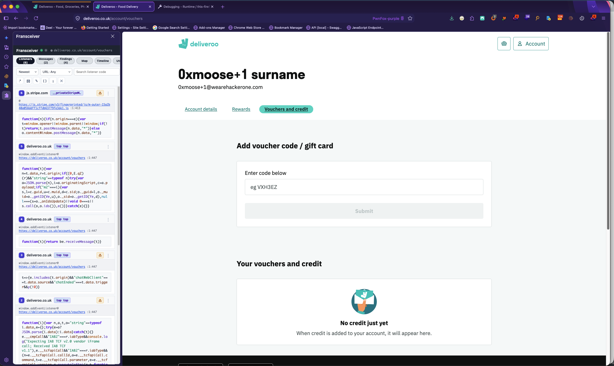
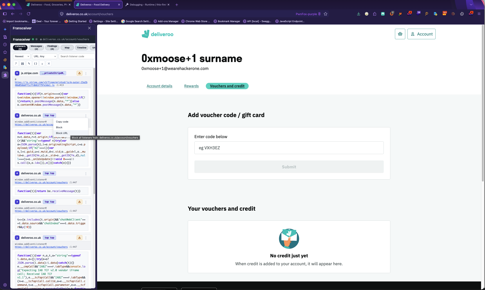
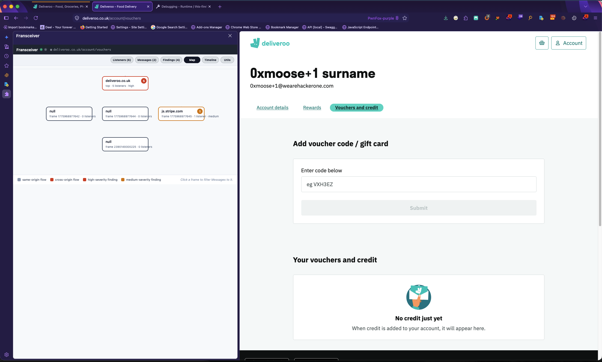
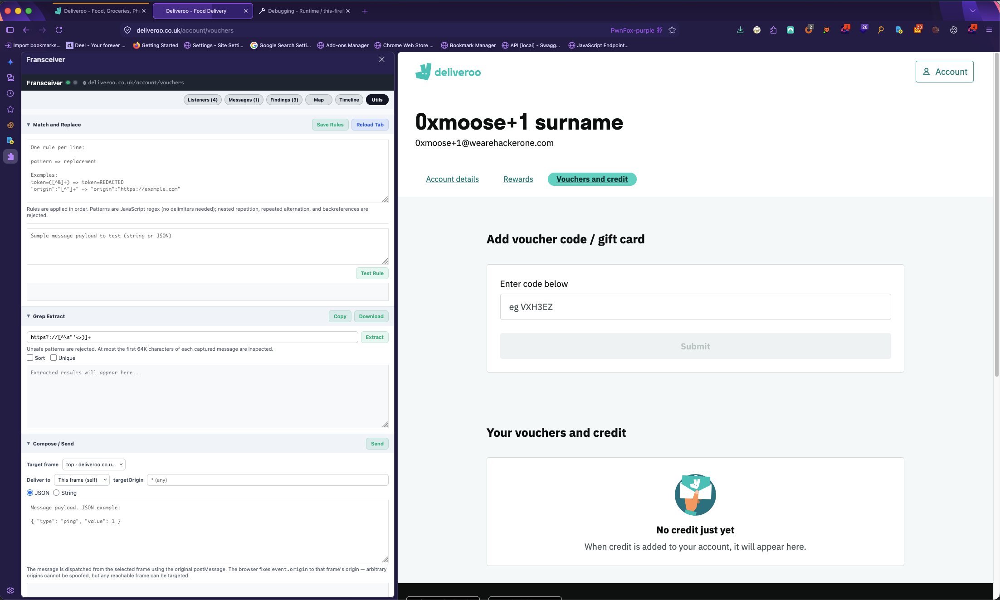
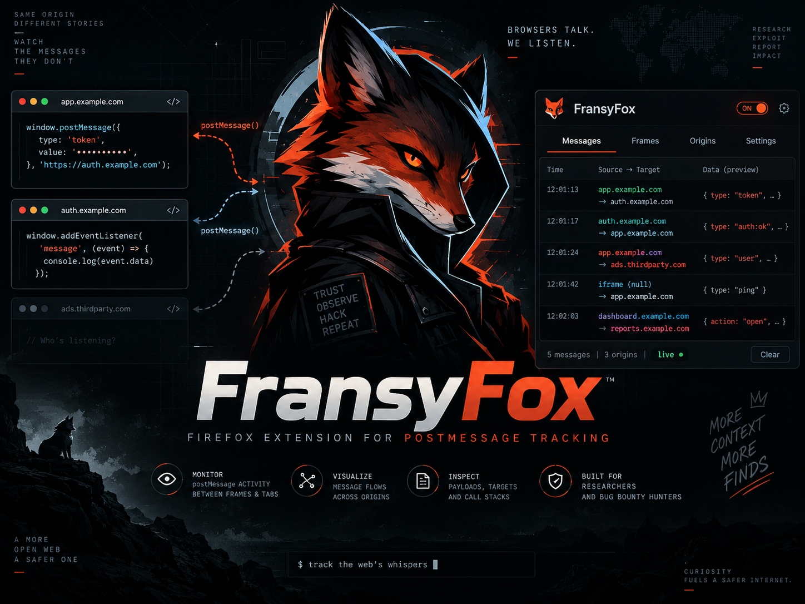

# Fransyfox

<div align="center">

**Watch every `postMessage` on the wire. Intercept, splice, and transmit your own.**

*KISS tooling for bug bounty and client-side security research — one panel, two browsers.*

[](https://github.com/GangGreenTemperTatum/Fransyfox/releases)
[](https://github.com/GangGreenTemperTatum/Fransyfox/actions)
[](https://github.com/GangGreenTemperTatum/Fransyfox/actions)
[](https://github.com/GangGreenTemperTatum/Fransyfox#install)
[](https://github.com/GangGreenTemperTatum/Fransyfox#install)
[](https://addons.mozilla.org/en-US/firefox/addon/fransyfox/)
[](LICENSE)
[](https://github.com/GangGreenTemperTatum/Fransyfox/stargazers)

</div>

Fransyfox (pronounced *fran-SEE-fox*) is a browser extension that watches
`postMessage` traffic on every web page you visit. Like a fox with its ear
to the wire, it hears every signal a page sends — and it knows how to howl
back.

It detects `postMessage` listeners registered by pages across all frames and
origins, shows their source code and stack traces, captures cross-frame
messages, and lets you filter, splice, and replay them.

Available for **Chrome/Chromium** (MV3 side panel) and **Firefox 128+**
(extension sidebar).

> **Named in honor of [Frans Rosén](https://twitter.com/fransrosen) and his
> original [postMessage-tracker](https://github.com/fransr/postMessage-tracker).**
> This extension exists because of him — [full credits below](#credits--hall-of-fame).

## Screenshots

<table>
<tr>
<td align="center"><br><b>Fransyfox</b></td>
<td align="center"><br><b>Fransyfox</b></td>
</tr>
<tr>
<td align="center"><br><b>Fransyfox</b></td>
<td align="center"><br><b>Fransyfox</b></td>
</tr>
</table>

## Why the name

Fransyfox is named after **Frans Rosén** ([@fransrosen](https://twitter.com/fransrosen)) — the legendary security researcher who built the original
[postMessage-tracker](https://github.com/fransr/postMessage-tracker).

It's *Fransy* — the community's affectionate name for Frans, passed down
through FancyTracker and FransyTracker — plus *Fox*, the animal that prowls
silently, listens to everything, and survives on its wits (and, of course,
the fox in the Firefox logo this extension happily ships for). Every time
this tool helps you find a bug in somebody's cross-frame messaging, it's
standing on Frans's shoulders.

## Credits — hall of fame

Fransyfox is a modern, cross-browser spiritual successor. Everything here
traces back to the work of three people. Go star and thank them:

| Project | Author | Role |
|---------|--------|------|
| [postMessage-tracker](https://github.com/fransr/postMessage-tracker) | [Frans Rosén](https://twitter.com/fransrosen) | **The original.** The one that started everything. Before it, mapping a site's `postMessage` listeners meant reading minified bundles with a crystal ball. Frans handed the research community a tool that made cross-frame attacks *visible*, and it changed how a generation of appsec people approach client-side bugs. |
| [FancyTracker](https://github.com/Zeetaz/FancyTracker) | Erik Zettergren | Extended fork of the original with the rich side-panel UI that Fransyfox's interface descends from. |
| [FransyTracker](https://gitlab.com/joaxcar/fransytracker) | Johan Carlsson | Manifest V3 modernization, findings engine, message timeline, and the battle-tested service-worker persistence model. Fransyfox's codebase is derived from this — it was FransyTracker that ran in a side panel for years while browser politics tore the original down and rebuilt it. |
| Fransyfox | You, reading this | This repo: renamed, rebuilt for Firefox 128+ *and* Chrome, re-verified end-to-end so the lineage lives on. |

All upstream work is MIT-licensed — see [LICENSE](LICENSE).

> **Frans, if you ever stumble on this: thank you. The `postMessage` on
> every site still hums for you. 73.**

## Features

- **Listener detection** — monitors every `postMessage` listener registered
  via `addEventListener` / `onmessage` across all frames, showing source code,
  stack traces, and frame hops. Unwraps wrappers (jQuery, sentry, raven,
  newrelic, rollbar, bugsnag, zone.js, vue, react, and more).
- **Message interception** — captures window and `MessagePort` traffic with
  origin, source/target frame, payload, and timing. Flood-protection batching
  keeps heavy pages responsive.
- **Deduplication** — identical listeners from the same source are collapsed.
- **Findings engine** — rule-based analysis flags risky listeners
  (innerHTML, eval, location.href, origins, etc.) ranked by severity.
- **Match & Replace** — live regex splicing of `postMessage` payloads, both
  directions. Intercept and rewrite messages as they fly.
- **Composer** — craft and send your own `postMessage` payloads into any frame.
- **Map / Timeline** — frame-tree graph and message timeline views.
- **Filtering & blocking** — block noisy or trusted listeners by code, URL, or
  regex (safe-subset regex engine; ReDoS-bait is rejected).
- **Syntax highlighting & prettify** — highlight.js + custom color rules,
  code beautify, adjustable fonts/lines/thresholds.
- **Import/export** — blocked lists, listeners, messages, and findings as JSON.
- **External logging** — forward detected listeners to your own endpoint.

## Install

### Release artifact (no build needed)

Grab `fransyfox-v<tag>-chrome.zip` / `fransyfox-v<tag>-firefox.zip` from
[Releases](https://github.com/GangGreenTemperTatum/Fransyfox/releases):

- **Chrome**: unzip, then `chrome://extensions` → **Developer mode** →
  **Load unpacked** → the extracted folder. Click the toolbar icon to open
  the side panel.
- **Firefox**: unzip, then `about:debugging#/runtime/this-firefox` →
  **Load Temporary Add-on…** → the extracted `manifest.json`. Click the
  toolbar button to toggle the sidebar.

### Build from source

```bash
npm install
npm run build      # emits dist/chrome/ and dist/firefox/
```

Then load `dist/chrome/` (Chrome) or `dist/firefox/manifest.json` (Firefox)
the same way as above. Quality gates: `npm run typecheck`, `npm run lint`,
`npm run test`.

### Firefox Add-on (AMO)

<div align="center">

</div>

Fransyfox is available on [addons.mozilla.org](https://addons.mozilla.org/en-US/firefox/addon/fransyfox/). Install it directly from AMO for a permanent Firefox extension that auto-updates.

### Firefox vs Chrome

| Feature | Chrome | Firefox |
|---------|--------|---------|
| Panel UI | Side panel (per-tab) | Extension sidebar (follows active tab) |
| MAIN-world hooks | ✓ | ✓ (128+) |
| "Go to source" in DevTools | ✓ | Not supported — reports an error |

## END-TO-END TEST (Firefox)

`npm run e2e:firefox` launches a real Firefox, loads the add-on, opens a test
page, and verifies the full pipeline through the extension's real port
protocol, covering:

1. MAIN-world content script injection and hooks
2. Listener capture (source + stack) through bridge → service worker
3. postMessage capture with tab attribution
4. Frame tree building
5. Panel UI loading in an extension context
6. Deduplication (double registration collapses to one)
7. Match & Replace live payload splicing (rule → broadcast → MAIN world)
8. State persistence across an extension reload (`runtime.reload`)

Requirements: Firefox Developer Edition or Nightly (release builds enforce
add-on signing — set `FIREFOX_BIN`), [geckodriver](https://github.com/mozilla/geckodriver)
on `PATH`, Python 3 with `selenium`. Logs and screenshots land in
`scripts/e2e/artifacts/`.

Unit tests (`npm run test`) cover the environment-agnostic logic: message
contracts, state normalization, blacklist matching, capture serialization,
event store, regex safety, and the browser-surface adapter
(`src/shared/browser-env.ts`).

## Docs

- [CLAUDE.md](CLAUDE.md) — agent guide / architecture cheat sheet
- [ARCHITECTURE.md](ARCHITECTURE.md) — architecture + regression matrix
- [SMOKE_CHECKLIST.md](SMOKE_CHECKLIST.md) — manual smoke checklist

## License

MIT — see [LICENSE](LICENSE). Long live the original credit lines.